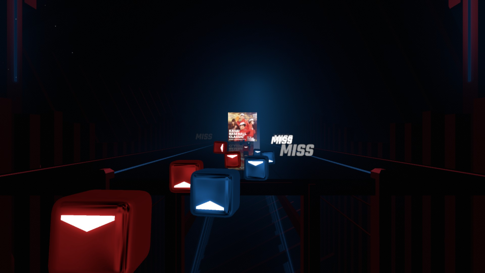
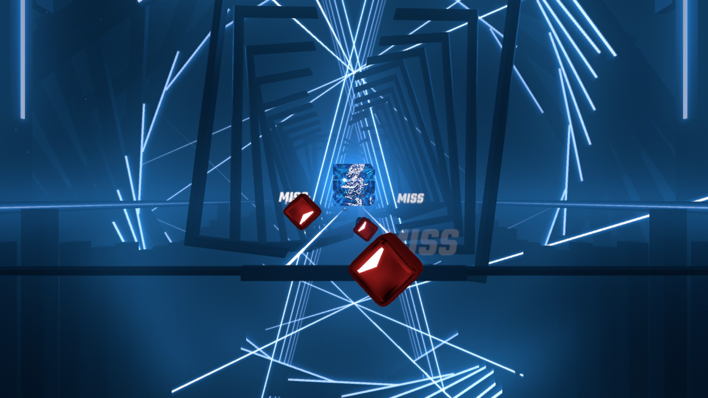

# Cover Art
Cover Art is a mod for Beat Saber that displays the cover art of the current beatmap in the distance.

## Installation

- Install BS Utils and BeatSaberMarkupLanguage
- Place SongArt.dll in the Beat Saber Plugins folder

## Settings

All of the following settings can be adjusted using the in-game Mod Settings menu:
- Fade Out (bool): Allows the cover art to fade out after a specified amount of time.
- Fade Delay (int): The time (in seconds) that the cover art lasts until it fades out. This also acts as the cooldown timer before the environment lights affect the transparency of the cover image.
- Transparency (float): The base transparency of the cover image.
- Distance (int): The distance the cover art is from the player.
- Y Offset (int): The distance the cover art is from the ground.
- Scale (int): The scale of the cover art.

## Known Issues

- Chroma light colors are not currently supported